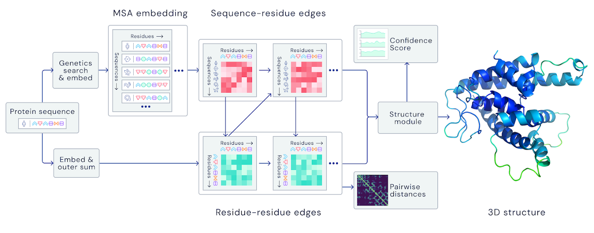
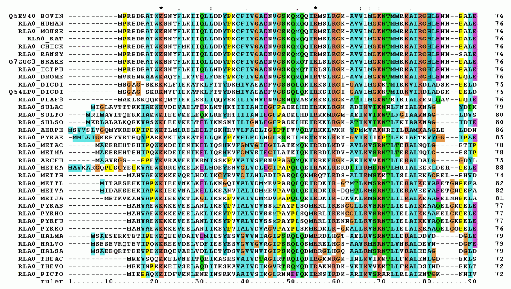
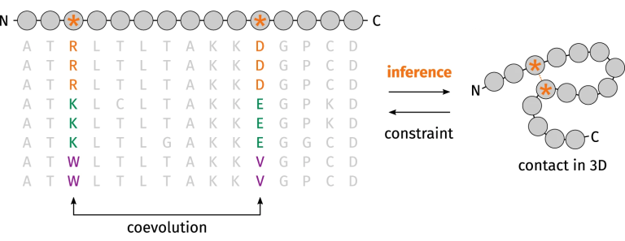
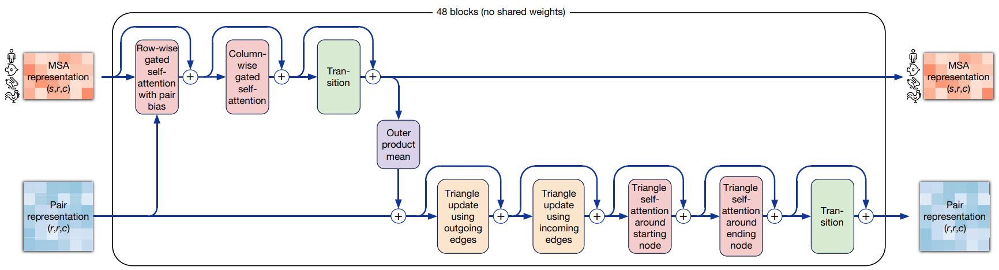

# Install

```
pip install openmm alphafold2-pytorch
pip install "git+https://github.com/facebookresearch/pytorch3d.git@stable"
```


https://www.blopig.com/blog/2021/07/alphafold-2-is-here-whats-behind-the-structure-prediction-miracle/


Peformed on random data to test the functionality of the code as alhpafold requires quite a bit of data for the sequence alignment




## Multiple Sequence Alignment MSA



### Co-evolution


## Pair representation

## Evo former



## Structure module